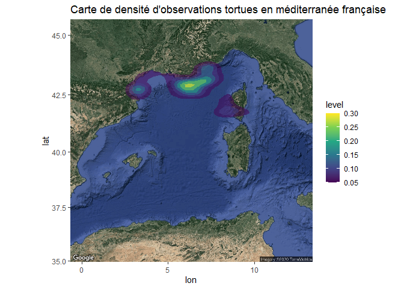
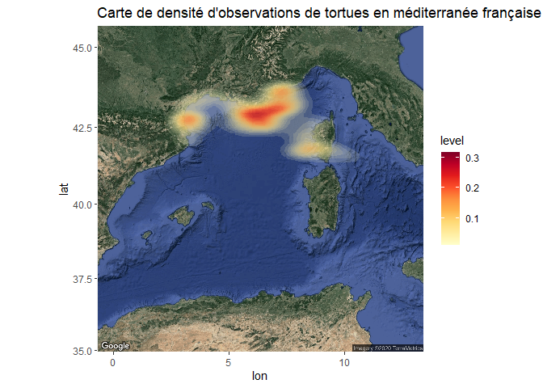

**Charger les packages** Charger les packages nécéssaires à la création
d’une carte de densité.

``` r
library(ggplot2)
library(RgoogleMaps)
library(ggmap)
```

    ## Google's Terms of Service: https://cloud.google.com/maps-platform/terms/.

    ## Please cite ggmap if you use it! See citation("ggmap") for details.

``` r
library(tidyr)
library(RColorBrewer)
```

**Charger les données**

On importe un set de données comportant uniquement des données de GPS.
Ces coordonnées correspondent par exemple à des observations de tortues
faites en Méditerranée française. Bien s’assurer que les données gps
sont au format **numérique**

``` r
#set de données avec uniquement les données gps
gps<-read.csv2("gps.csv", header=TRUE, sep =  ";")

#on enlève les lignes a valeurs manquantes avec drop_na from tidyr
gps_na <- gps %>% drop_na(lon,lat)

#on met au format dnumeric
gps_na$lon<-as.numeric(gps_na$lon)
gps_na$lat<-as.numeric(gps_na$lat)
```

Ensuite il faut établir une connexion avec les services map de google en
utilisant une clef API afin de pouvoir charger le fond de carte. Pour
cela il faut suivre les instructions sur google.

``` r
#s'enregistrer sur google API avec une clef
register_google(key = "mQkzTpiaLYjPqXQBotesgif3EfGL2dbrNVOrogg") 
```

On utilise la fonction get\_map pour importer une carte dans un
objet.lon et lat fixe le centre de la carte que l’on souhaite, et le
zoom permet de cadrer. maptype permet de choisir quel type de carte on
veut. (“terrain”, “terrain-background”, “satellite”,
“roadmap”,“hybrid”). N’oubliez pas que vous pouvez toujours consulter
l’aide de R pour en savoir plus sur les fonctions en utilisant
`?get_map`.

``` r
#charger map satellite france
med_france<-get_map(location=c(lon = 6.35 , lat = 40.5), zoom = 6, language= "fr-FR", maptype="satellite")
```

    ## Source : https://maps.googleapis.com/maps/api/staticmap?center=40.5,6.35&zoom=6&size=640x640&scale=2&maptype=satellite&language=fr-FR&key=xxx-05QnQjlm3D_0

On utilise la fonction stat\_density\_2d permettant de tracer sur la
carte la densité de données.

``` r
#carte mediterranée française avec densité d'observations
ggmap(med_france) + stat_density_2d(aes(fill = ..level..), alpha=.5, geom="polygon", data = gps_na) + 
                                                                          scale_fill_viridis_c() +
              ggtitle("Carte de densité d'observations tortues en méditerranée française")
```



Ou dans un autre style.

``` r
ggmap(med_france) +stat_density_2d(data = gps_na,
                aes(x = lon,
                    y = lat,
                    fill = stat(level)),
                alpha = .15,
                bins = 25,
                geom = "polygon") +
        scale_fill_gradientn(colors = brewer.pal(9, "YlOrRd")) +
              ggtitle("Carte de densité d'observations de tortues en méditerranée française")
```


